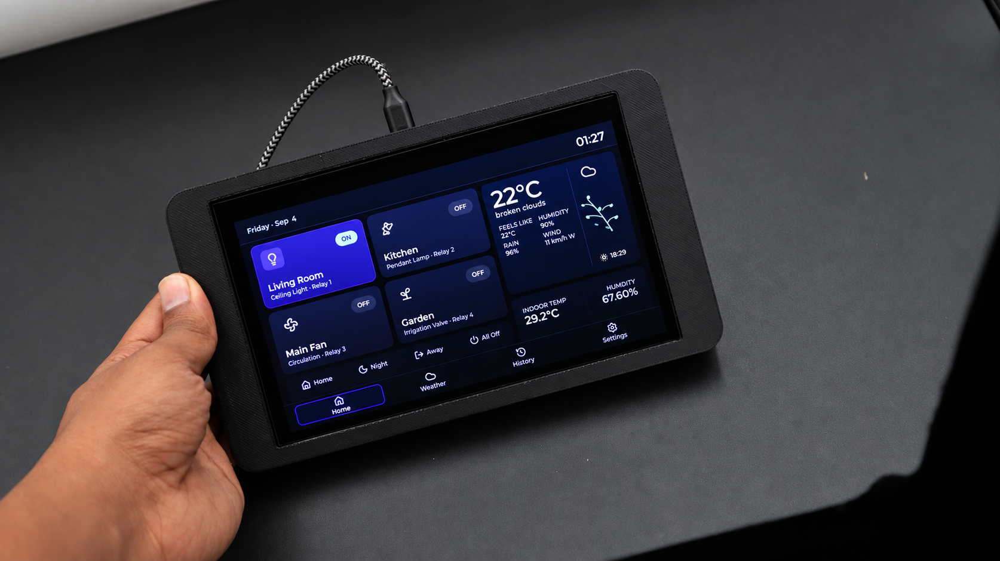

# DIY ESP32 Touchscreen Home Automation Control Panel

A simple DIY home automation project using an ESP32 touchscreen panel and an ESP32 relay node.

## Main Features

- Touchscreen dashboard for controlling home devices
- 4-channel relay control node
- ESP-NOW communication between display and relay board
- DHT22 temperature and humidity support on the relay node

## Hardware / Files Included

- **Display firmware:** `source-code/smart-panel-display/`
- **Relay node firmware:** `source-code/relay-node/`
- **PCB and schematic files (KiCad):** `hardware/pcb/esp32-4-channel-relays/`
- **3D enclosure file:** `hardware/3d/touchscreen_enclosure.3mf`
- **Project photos and diagrams:** `media/photos/`

## Where to Find What

- Use `source-code/` for all Arduino/ESP32 source files.
- Use `hardware/pcb/` for PCB design files.
- Use `hardware/3d/` for enclosure/3D files.
- Use `media/photos/` for project photos and visuals.
